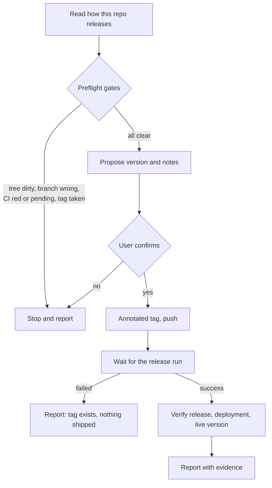

# Using the CI kit

The CI kit handles the end of a change: committing it so other people can review
it, and releasing it so other people can use it. It is deliberately strict about
one thing — a release is not reported as done until the pipeline has finished
and the deployed service has answered.

Use it on any repository that keeps its history in Git. The release skill also
needs a pipeline that reacts to a version tag.

## What you need

- Claude Code or Codex with the `ci` collection installed.
- A Git repository and a remote you can push to.
- For releases: a pipeline triggered by a tag push, and a command-line client
  for your CI host, such as `gh` for GitHub, so run status can be read for one
  commit.
- Repository instructions such as `AGENTS.md`, `CLAUDE.md`, or `CONTRIBUTING.md`
  if you have branch, message, or release conventions. Both skills read them
  first and follow them over their own defaults.

## Two-minute path

Finish your work, then hand the tree over:

Claude Code:

```text
/ci:commit-and-push
```

Codex:

```text
$ci-commit-and-push
```

The agent reads the diff, groups it into logical commits, stages each group by
path, and pushes once. It reports the commits it made and anything it chose to
leave behind.

When the branch is where you want it and CI has run, release:

```text
/ci:tag-and-release
```

It proposes a version, shows you what the release contains, and waits. After you
approve, it tags, pushes, watches the pipeline, and tells you whether the new
version is live.

## The release path



Every branch that leaves this diagram ends in a report you can act on. The one
outcome the skill will not produce is a claim of success it did not check.

## What the gates actually check

The gate that matters most is the CI check, because it is the one most often
faked by eye. The skill resolves the commit it is about to tag and asks the host
about **that SHA**:

```bash
sha=$(git rev-parse HEAD)
gh run list --commit "$sha" --json workflowName,status,conclusion
```

- No runs for that commit means nothing was proven. That is a stop.
- A run still queued or in progress is not green. That is a stop, though you can
  wait and re-run the skill.
- `failure`, `cancelled`, `timed_out`, and `action_required` are all red.

The remaining gates catch the ordinary mistakes: a dirty working tree, a branch
the pipeline does not build, a commit the remote has never seen, a version
already taken, or a tag with no commits behind it.

## What "released" means here

After the tag is pushed, the skill waits for the pipeline and then checks what
that pipeline claimed it would do:

1. the run finished with `success`;
2. the release object exists and is not a draft;
3. the deployed environment's health endpoint returns a success status;
4. where the service reports a version, build, or commit, it reports the tag
   that was just pushed.

The fourth check is the one that separates "the deployment rolled" from "the old
version is still serving". If your service has no version endpoint, the skill
says so in its report rather than letting silence read as confirmation.

If the pipeline fails after the tag is pushed, the skill says plainly that the
tag exists and nothing shipped, shows the failing job's log, and asks whether to
fix forward with a new version or remove the tag. It will not delete a published
tag on its own.

## Choosing a version

With no argument the agent proposes one from the commits since the last tag and
explains the choice in a sentence. You can also be explicit:

```text
/ci:tag-and-release patch
/ci:tag-and-release v2.0.0
/ci:tag-and-release minor --notes RELEASE-NOTES.md
```

The tag is annotated and its message is the release note, written in the format
your previous tags use. If your repository maintains a changelog by hand, update
and commit it before releasing — the CI gate has to pass on the commit that is
actually tagged.

## How commits get grouped

`commit-and-push` splits by intent, not by file:

- a bug fix travels with its regression test;
- a feature travels with the documentation that describes it;
- a wide rename is one commit;
- formatting and dependency bumps are separate commits, never mixed with
  behaviour.

It stages by explicit path, so `git add -A` and `git add .` never run, and it
decides untracked files one at a time. Build output, scratch files, and anything
that looks like a leaked credential stay out, and it tells you what it left.

## Command reference

| Task | Claude Code | Codex |
| --- | --- | --- |
| Commit the tree and push | `/ci:commit-and-push` | `$ci-commit-and-push` |
| Release the current commit | `/ci:tag-and-release` | `$ci-tag-and-release` |

## Troubleshooting

### The skill stops saying CI is not green

Check the runs for the exact commit, not the branch:
`gh run list --commit $(git rev-parse HEAD)`. A branch can be green while your
newest commit has no run at all — that is precisely the case the gate exists
for.

### It refuses because the tag already exists

Versions are never reused or moved. Pick the next version, or delete the unused
tag yourself if it was created by mistake and nothing has consumed it.

### The pipeline succeeded but the version check failed

The release built and deployed, but the environment is still reporting the old
version. Usually the rollout has not finished or it rolled back. Look at the
deployment before tagging anything else.

### Nothing in my repository releases on a tag

The skill stops rather than pushing a tag into silence. Add a tag-triggered
pipeline, or release by whatever mechanism your repository actually uses.

## Limits

- The release skill needs a tag-triggered pipeline; it does not build or deploy
  anything itself.
- Reading CI status needs a host client the agent can run, such as `gh`.
- Neither skill invents changes. `commit-and-push` commits what exists, and
  `tag-and-release` releases the commit you are on.
