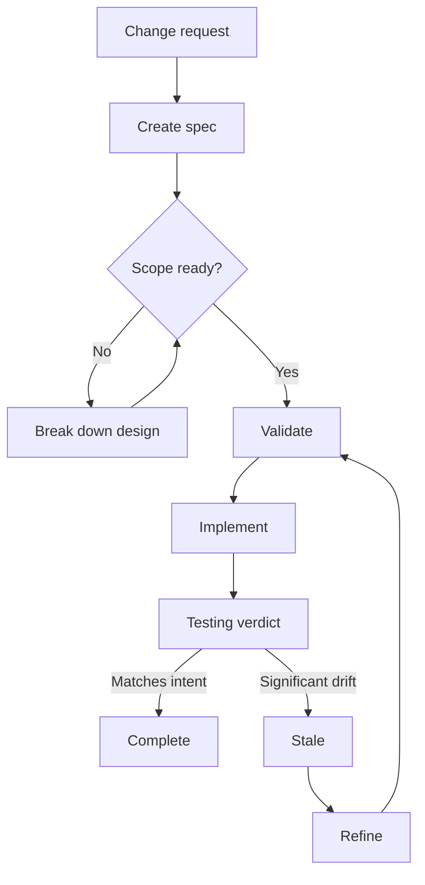
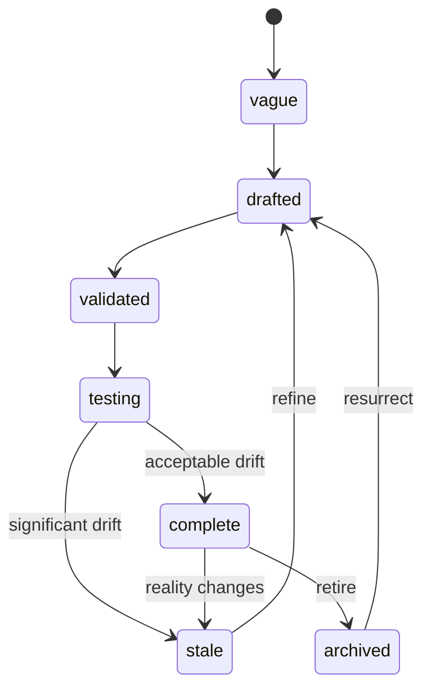

# Using the spec kit

The spec kit helps an agent carry a change from intent to verified delivery.
It keeps the design, dependencies, implementation evidence, and final outcome
in version-controlled Markdown instead of leaving them in a chat transcript.

Use it when a change has meaningful scope, dependencies, review risk, or a
longer lifetime than one coding session. For a tiny edit with an obvious fix,
your repository's normal issue and test workflow may be enough.

## What you need

- Claude Code or Codex with the `spec` collection installed.
- A Git repository the agent can inspect.
- Repository instructions such as `AGENTS.md`, `CLAUDE.md`, `CONTRIBUTING.md`,
  or a clear `README.md`.
- Test and build commands documented in the repository or visible in CI.

You do not need a task board, server, database, or project-management product.
The default workflow only edits Markdown and code in your repository.

## Five-minute path

Start by describing the outcome, not the implementation.

Claude Code:

```text
/spec:create product/cache-warming Add bounded cache warming so the first user request does not pay the full load cost
```

Codex:

```text
$spec-create product/cache-warming Add bounded cache warming so the first user request does not pay the full load cost
```

On a repository without a `specs/` tree, `create` bootstraps one. On an existing
tree, it follows the repository's current track and numbering conventions. Note
the path it reports, because a repository may use `specs/cache-warming.md`,
`specs/product/cache-warming.md`, or a numbered variant.

Review the new spec. When the scope and acceptance criteria are right, ask the
orchestrator to take it forward:

Claude Code:

```text
/spec:drive specs/cache-warming.md
```

Codex:

```text
$spec-drive specs/cache-warming.md
```

`drive` chooses the next legal step from the spec's current status. For a small,
clear change it can validate, implement, test, and wrap up the spec. It pauses
before outward or hard-to-reverse actions, such as dispatching work to a task
board.

## How the spec workflow fits together



The default workflow only needs Markdown and Git. Repositories with a compatible
task-board transition API can also dispatch specs as linked tasks, but no server
is required.

## Choose the right workflow

| Situation | Start with | What happens |
| --- | --- | --- |
| New, focused change | `create`, then `drive` | One spec moves from draft to verified outcome |
| Large change with open design questions | `create`, then `breakdown` in design mode | The parent becomes smaller design problems before implementation |
| Large change with a settled design | `breakdown` in tasks mode, then `review-breakdown` | The design becomes implementation-ready leaves with checked dependencies |
| Existing spec no longer matches the code | `refine` | Shipped or obsolete scope is removed and the remaining design is updated |
| Need a pre-build blast-radius check | `impact` | Code, tests, docs, and dependent specs at risk are reported without edits |
| Need to judge completed work | `review-impl` | Acceptance criteria, tests, boundaries, and unintended changes receive a verdict |
| Need current portfolio status | `report` | Complete, active, blocked, stale, and actionable specs are summarized |
| Spec filenames and indexes have drifted | `housekeeping` | One directory's numbering and index are repaired |

When you are unsure, use `drive` for one spec or `report` for the whole tree.

## The document model

Every spec is a Markdown file with YAML frontmatter. The body explains the
problem and proposed solution. The frontmatter gives tools a small amount of
structured state.

```yaml
---
title: Cache warming
status: drafted
track: product
depends_on: []
affects:
  - internal/cache/
effort: medium
created: 2026-08-22
updated: 2026-08-22
author: your-name
dispatched_task_id: null
---
```

`track` can come from the file's directory or from frontmatter. A repository
may also prefix filenames with `NNN-` to set a reading order within one
directory. Neither choice defines dependency order. Only `depends_on` does.

Use `affects` to name the code and documentation expected to change. Specific
paths improve impact analysis and make unexpected implementation changes easier
to spot.

## The lifecycle



The diagram shows the common delivery and recovery paths. The table below is
the authoritative state reference; `archive` is also available from other
non-terminal states when work is intentionally retired.

| State | Meaning | Normal next move |
| --- | --- | --- |
| `vague` | The idea needs more discovery | Refine it into a concrete draft |
| `drafted` | The design exists but has not passed structural review | Validate or break it down |
| `validated` | Scope and dependencies are ready to build | Implement directly or dispatch |
| `testing` | Code landed and the spec-to-implementation verdict is pending | Review drift and wrap up |
| `complete` | The outcome was checked and recorded | Leave as history or archive later |
| `stale` | The spec no longer matches reality | Refine before relying on it |
| `archived` | The work is retired | Resurrect only when the work becomes active again |

There is no direct `validated -> complete` transition. The `testing` state is
the evidence gate: implementation is compared with the design before the spec
is allowed to claim completion.

## Small changes

For a focused change that one agent can implement in one pass:

1. Run `create` with a clear outcome and track.
2. Read the generated Current State, Architecture, Testing Strategy, and
   acceptance criteria. Correct assumptions before code changes begin.
3. Run `drive` on the reported path.
4. Approve the implementation plan when prompted.
5. Review the final Outcome section and commits.

If you want explicit control, run `validate`, advance the spec to `validated`,
then run `implement`. A full implementation delegates finalization to `wrapup`,
which records drift and moves through the testing gate.

## Large changes

Break down work when a spec crosses subsystem boundaries, contains independent
deliverables, or cannot be reviewed as one implementation.

Use design mode while important choices are still open:

```text
/spec:breakdown specs/platform-redesign.md design
$spec-breakdown specs/platform-redesign.md design
```

Use tasks mode after the design is settled:

```text
/spec:breakdown specs/platform-redesign.md tasks
$spec-breakdown specs/platform-redesign.md tasks
```

Then run `review-breakdown`. It checks dependency order, task size, coverage
gaps, and overlapping file boundaries before implementation starts. Drive or
implement the leaf specs in dependency order. The parent is complete only when
its leaves are complete.

## Reviews, drift, and completion

`review-impl` is a read-only review. It classifies every acceptance criterion,
flags scope creep, checks test evidence, and returns a verdict.

`drift` records how the implementation differs from the design. Minimal drift
supports completion. Moderate drift belongs in the Outcome. Significant drift
makes the spec stale so the document cannot silently misrepresent what shipped.

`wrapup` is the finalizer. It verifies the repository's own test and build
gates, runs drift analysis, writes one canonical Outcome section, updates the
spec index, and follows legal lifecycle transitions.

## Working as a team

Agree on four conventions before the tree grows:

1. **Tracks:** document each track and its purpose in `specs/README.md`.
2. **Spec threshold:** decide which changes need a spec. A useful default is any
   change that crosses packages, changes a public contract, or needs coordinated
   rollout.
3. **Validation owner:** name who can accept the design before implementation.
4. **Completion evidence:** require tests, documentation, commit links, and
   material deviations in the Outcome.

Keep specs in the same review process as code. A dependency edge should mean
"cannot be implemented correctly before this lands," not merely "related to."
Archive completed specs only when the repository's convention calls for it;
their history remains useful during later changes.

## Optional task-board integration

The default path is file-based. If the repository exposes the transition API
described by the `dispatch` skill, `dispatch` can create linked tasks and update
frontmatter atomically. The skill probes for this integration and falls back to
files when it is absent.

Dispatching creates outward work, so `drive` pauses for human approval before
using a task board. A dispatched task may finish asynchronously; run `drive` or
`wrapup` again after it completes to record the result.

## Command reference

| Purpose | Claude Code | Codex |
| --- | --- | --- |
| Create a spec | `/spec:create` | `$spec-create` |
| Refine a stale or outdated spec | `/spec:refine` | `$spec-refine` |
| Validate structure and dependencies | `/spec:validate` | `$spec-validate` |
| Analyze blast radius | `/spec:impact` | `$spec-impact` |
| Split a large spec | `/spec:breakdown` | `$spec-breakdown` |
| Review a breakdown | `/spec:review-breakdown` | `$spec-review-breakdown` |
| Dispatch implementation work | `/spec:dispatch` | `$spec-dispatch` |
| Implement a validated spec | `/spec:implement` | `$spec-implement` |
| Review implementation evidence | `/spec:review-impl` | `$spec-review-impl` |
| Record implementation drift | `/spec:drift` | `$spec-drift` |
| Finalize a completed spec | `/spec:wrapup` | `$spec-wrapup` |
| Orchestrate the lifecycle | `/spec:drive` | `$spec-drive` |
| Report tree status | `/spec:report` | `$spec-report` |
| Repair numbering and indexes | `/spec:housekeeping` | `$spec-housekeeping` |

Arguments follow the same order in both harnesses. Only the invocation prefix
changes.

## Troubleshooting

### Codex does not show the skills

Installed skills become available on the next Codex turn. Confirm that the
installer wrote directories such as `$CODEX_HOME/skills/spec-create`, or
`~/.codex/skills/spec-create` when `CODEX_HOME` is unset.

### Reinstalling reports an existing skill

The installer does not overwrite installed skills because they may contain
local changes. Review and remove only the affected `spec-*` directories, then
run the installer again.

### Validation reports a missing dependency

Every `depends_on` value is a repository-root-relative path to another spec.
Fix the path or remove the edge if the work is related but not a prerequisite.

### A completed spec no longer matches the code

Run `refine`. It preserves the useful design context, removes work that already
shipped or became obsolete, and returns the remaining work to an active state.

### The workflow feels too heavy

Use the shortest useful path: `create` followed by `drive`. Reserve breakdown,
dispatch, and housekeeping for changes that need them.

## Limits

The kit is a set of agent instructions, not a deterministic build system. It
improves the structure and auditability of agent work, but it does not replace
code review, repository permissions, CI, or human judgment at release gates.
Its results depend on accurate repository instructions and executable tests.

For the exact document rules and current skill inventory, see the
[spec collection reference](../plugins/spec/README.md).
